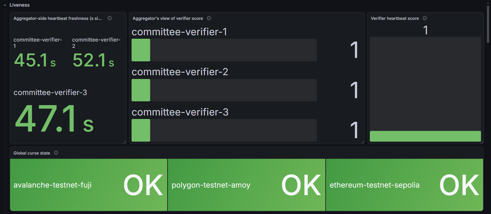
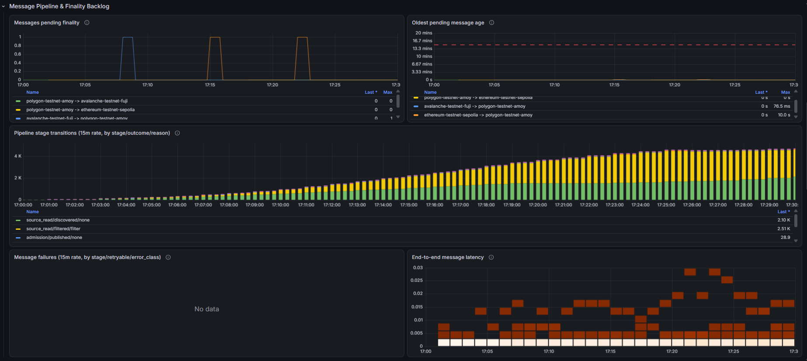

# CCV Cell Deployment Runbook

Deploy the [`ccv-cell`](charts/ccv-cell) Helm chart for [Chainlink CCV](https://github.com/smartcontractkit/chainlink-ccv).
Full field reference: the [chart README](charts/ccv-cell/README.md) (generated from [values.yaml](charts/ccv-cell/values.yaml)).

**A CCV Cell is one aggregator plus one verifier (1 pod each).** The verifier watches on-ramps, verifies messages,
signs results, and sends them to an aggregator. The aggregator checks signed results against quorum. Multiple
cells form a **committee**; each cell's Postgres/secrets/KMS isolation requirements are in the chart's
[Requirements](charts/ccv-cell/README.md#requirements).

Looking for how to deploy the on-chain contracts necessary for a CCV Cell? [Look here!
](https://github.com/smartcontractkit/chainlink-ccv-starter-kit-contracts) The contracts will require the hostnames,
signers addresses and chains configured in your committee's cells.

## Table of Contents

- [1. Prerequisites](#1-prerequisites)
- [2. Configure the Values](#2-configure-the-values)
- [3. Deploy](#3-deploy)
- [4. Verify it worked](#4-verify-it-worked)
- [5. If a pod won't start](#5-if-a-pod-wont-start)
- [6. Upgrades, rollback, scaling](#6-upgrades-rollback-scaling)
- [7. Committee size recommendations](#7-committee-size-recommendations)
- [8. Peer information and credential exchange](#8-peer-information-and-credential-exchange)
- [9. Metrics: deploy an OTel Collector](#9-metrics-deploy-an-otel-collector)
- [10. Monitoring the cell](#10-monitoring-the-cell)
- [11. Alerting](#11-alerting)

## 1. Prerequisites

- Cluster and infra dependencies (Gateway/Ingress + mesh, Postgres, secrets manager, KMS, Cloud IAM): see the
  chart's [Requirements](charts/ccv-cell/README.md#requirements).
- Config field reference: `docs/config/` in `chainlink-ccv`:
  [aggregator](https://github.com/smartcontractkit/chainlink-ccv/blob/main/docs/config/aggregator/config.documented.toml)·
  [verifier](https://github.com/smartcontractkit/chainlink-ccv/blob/main/docs/config/verifier/committee/config.documented.toml)·
  [bootstrap](https://github.com/smartcontractkit/chainlink-ccv/blob/main/docs/config/bootstrap/config.documented.toml)·
  [evm](https://github.com/smartcontractkit/chainlink-ccv/blob/main/docs/config/evm/config.documented.toml).
  Field names match the chart's `*.config` keys _almost_ 1:1. If you are not sure how to convert, simply write the
  original TOML file, convert it drop the result under the matching `*.config` key.
- RPC endpoints: the verifier reads each chain it serves as a message source (`evm.config.chains`) — polling
  logs and validating source-chain finality — so every configured chain needs a reliable RPC. Use providers
  that meet the Chainlink [RPC node requirements](https://docs.chain.link/resources/network-integration)
  (multiple independent providers, an archive node, sustained throughput and low latency). You can list several
  nodes per chain with an `order` for failover; see [§5](#5-if-a-pod-wont-start) if you hit RPC timeouts or 429s.

## 2. Configure the Values

Deployment is done through a standard Helm Chart's values. If this isn't clear to you, check-out [Helm's docs](
https://helm.sh/docs/intro/introduction) before proceeding.

If you've never used Helm, a good starting point it to create a new `my-values.yaml` file, empty, and open on the side
the chart provided `values.yaml`. You can then follow along the original file, and override any values as you need.
Every value accompanies a small snippet documentation, commented out example, or helper link.

We do not recommend you copy the entire file, since you'll have to maintain all values, specially across
updates, making maintenance difficult.

We'll detail here the "important bits" to watch out for.

### Configs

A minimal values file that renders and starts cleanly, with placeholder addresses, `existingSecret`s, and one fake
chain (see below for the secrets). Swap in real addresses and RPC URLs before trusting it beyond a smoke test:

```yaml
aggregator:
  config:
    clients:
      - clientId: committee-verifier-1
        groups: ["default"]
        enabled: true
    committee:
      quorumConfigs:
        "1":
          sourceVerifierAddress: "0x00000000000000000000000000000000000000a1"
          threshold: 1
          signers:
            # Your first signer will be your own address, see below
            - address: "0x00000000000000000000000000000000000000b1"
      destinationVerifiers:
        "2": "0x00000000000000000000000000000000000000c2"
  secrets:
    app:
      type: existingSecret
      existingSecret:
        name: aggregator-app-secret

verifier:
  config:
    verifier_id: "committee-verifier-1"
    signer_address: "auto"  # See below how to find this address for use above
    aggregators:
      - name: aggregator-1
        secret_name: aggregator_1
        useInClusterAggregator: true
    committee_verifier_addresses:
      "1": "0x00000000000000000000000000000000000000c1"
    on_ramp_addresses:
      "1": "0x00000000000000000000000000000000000000a1"
    rmn_remote_addresses:
      "1": "0x00000000000000000000000000000000000000b1"
  evm:
    config:
      chains:
        "1":
          nodes:
            - name: node-1
              http_url: "https://your-rpc-url"
              order: 1
  secrets:
    app:
      type: existingSecret
      existingSecret:
        name: verifier-app-secret
    bootstrap:
      type: existingSecret
      existingSecret:
        name: verifier-bootstrap-secret
```

The configs here map almost directly to the Verifier's and Aggregators settings, see their links for info.
Some changes include `useInClusterAggregator: true`, where the chart automatically configures the aggregator that is
also deployed in this chart for the verifier, sparing you from wiring it yourself. Read the values' documentation
for more info as you go.

Keep reading until the end of this guide for some tips and tricks on committee size, and how to organize values for
many ccv-cells deployments.

### Signer Address

The `signer_address` for your verifier will be used by the aggregator and other cells from the same committee. By
default, the verifier can infer its own address for bootstrapping, but you must find this information to finish
configuring the aggregator and other cells. Here are a few ways how:

1. **Verifier logs**  
   During startup, the verifier pods emits as a log the address. After the first deploy, search for `Using signer address`
   in the logs. With kubectl, it will look like this:
   ```shell
   kubectl -n "$NAMESPACE" logs ccv-cell-verifier-0 | grep "Using signer address" | jq -r .address
   # 0x1234567890abcdef9876543210fedcba01234567
   ```
   Your cluster probably has other log collection mechanisms available, contact your administrator if you are not
   sure.

2. **Bootstrap info endpoint**  
   The verifier pod has a bootstrap info server that is not publicly exposed by default. It can give you the signer
   address pre-calculated if you can port-forward:
   ```shell
   # In one terminal:
   kc port-forward ccv-cell-verifier-0 9988
   # Forwarding from 127.0.0.1:9988 -> 9988
   # Forwarding from [::1]:9988 -> 9988
 
   # In another
   curl -sSf -X POST http://localhost:9988/keystore/reader/getaddresses \
     -d '{"keyNames":["bootstrap_default_ecdsa_signing_key"]}' | jq -r .bootstrap_default_ecdsa_signing_key
   # 0x1234567890abcdef9876543210fedcba01234567
   ```

3. **Calculate it yourself from the public key**  
   If you have the public key in a file `public.pem`, a small Python script, using the [cryptography
   ](https://pypi.org/project/cryptography/) library, will give you the address:
   ```py
   import sys
   from cryptography.hazmat.primitives.serialization import load_pem_public_key
   from Crypto.Hash import keccak
   
   path = "public.pem"
   
   with open(path, "rb") as f:
       pub = load_pem_public_key(f.read())
   
   n = pub.public_numbers()
   point = n.x.to_bytes(32, "big") + n.y.to_bytes(32, "big")
   
   h = keccak.new(digest_bits=256)
   h.update(point)
   print("0x" + h.digest()[-20:].hex())
   # 0x1234567890abcdef9876543210fedcba01234567
   ```
   Most managed KMS solutions allow you fetch the public key, consult your cloud's documentation. 

After fetching your address, you can use in the aggregator's committee configs. You can also replace the verifier's own
`signer_address` setting, but it's not necessary.

### Secrets

To configure the application secrets,
Set `type` on each of `aggregator.secrets.app`, `verifier.secrets.app`, `verifier.secrets.bootstrap`
(and optionally `verifier.secrets.evm`):

- **`externalSecret`** (default): chart creates an `ExternalSecret` that pulls from your `SecretStoreRef` via
  `*RemoteRef` fields (e.g. `storageUrlRemoteRef`, per-client `apiKeyRemoteRef`/`secretKeyRemoteRef`).
- **`gcpSecretStore`**: chart creates a `SecretProviderClass` pointing at one `secretVersionResourceName` holding a
  full pre-built `secrets.toml`. Requires Workload Identity on `*.serviceAccount.annotations`.
- **`awsSecretStore`**: chart creates a `SecretProviderClass` using the [AWS ASCP](https://github.com/aws/secrets-store-csi-driver-provider-aws)
  pointing at one `secretName` (name or ARN) in AWS Secrets Manager holding a full pre-built `secrets.toml`.
  Supports both IRSA (annotate the ServiceAccount with `eks.amazonaws.com/role-arn`) and EKS Pod Identity
  (set `awsSecretStore.usePodIdentity: true` and create a Pod Identity association via EKS).
- **`existingSecret`**: you manage the `Secret` yourself, the chart just mounts it.

Both API Keys and Secrets keys are generated by you. `api_key` must be a UUID, `secret_key` must be hex-encoded.

See [Peer information and credential exchange](#8-peer-information-and-credential-exchange) below for a recommendation
on how to exchange credentials between peers.

#### Keystore backend

`verifier.secrets.bootstrap` also selects where the verifier's **signing key** lives:
`keystoreBackend: postgres` (default) or `keystoreBackend: kms`.

**On `externalSecret`, the chart writes the keystore block for you** from `keystoreBackend` and
`verifier.secrets.bootstrap.kms.*`.

**On `gcpSecretStore`, `awsSecretStore` and `existingSecret` you write `secrets.toml` yourself** and the
chart only mounts it. `keystoreBackend` and `kms.*` are ignored on those paths. For production, where a
managed KMS is recommended over a Postgres-held key, the block you need is:

```toml
[keystore]
backend = "kms"

[keystore.kms]
# "aws" or "gcp". Required; there is no default.
provider = "gcp"
# AWS: a Key ID or ARN. GCP: a CryptoKeyVersion resource name.
ecdsa_key_id = "projects/<p>/locations/<l>/keyRings/<r>/cryptoKeys/<k>/cryptoKeyVersions/1"
```

Credentials come from the cloud's default mechanism, never from this file: Workload Identity on GKE, IRSA
or EKS Pod Identity on AWS. Grant the workload access to **exactly these keys**, never a wildcard.

The full reference, including per-cloud IAM guidance, is
[`secrets.documented.toml`](https://github.com/smartcontractkit/chainlink-ccv/blob/main/docs/config/bootstrap/secrets.documented.toml).

### Ingress

You can configure an ingress to the aggregator, which must be exposed to the internet, using one of these three values:
```yaml
aggregator:
  ingress:
    enabled: false
    className: "some-ingress"
    host: "your-ccv-aggregator.example.com"

  grpcRoute:
    enabled: false
    annotations: {}
    labels: {}
    parentRefs:
      - group: gateway.networking.k8s.io
        kind: Gateway
        name: gateway
        namespace: istio-ingress
        sectionName: https
    hostnames:
      - "your-ccv-aggregator.example.com"

  httpRoute:
    enabled: false
    parentRefs:
      - group: gateway.networking.k8s.io
        kind: Gateway
        name: gateway
        namespace: istio-ingress
        sectionName: https
    hostnames:
      - "your-ccv-aggregator.example.com"
```

Note that they are all `enabled: false` by default. You only need to enable one. If you don't know which one, contact
your cluster administrator, and they'll be able to guide you properly. Note to them that the aggregator needs a
dedicated and unchanging hostname, exposed to the internet, and is gRPC.

### Resources

While not required, you'll see blocks like these:

```yaml
  # -- CPU/memory resource requests and limits for the <component> container. See [resources](https://kubernetes.io/docs/concepts/configuration/manage-resources-containers/).
  resources: {}
    # limits:
    #   cpu: 1500m
    #   memory: 1Gi
    # requests:
    #   cpu: 1
    #   memory: 512Mi

  # -- CPU/memory resource requests and limits for the entire pod. See [resources](https://kubernetes.io/docs/concepts/configuration/manage-resources-containers/).
  podResources: {}
    # limits:
    #   cpu: 2
    #   memory: 2Gi
    # requests:
    #   cpu: 1
    #   memory: 1Gi
```

It is highly recommended that you configure resources for any production deployment. Normally, requests and limits
memory must be equal, and request CPU is defined, while limits aren't. The commented out values are a good baseline.
Check with your cluster administrator when in doubt.

### Service Accounts

You'll also see blocks like this:
```yaml
  serviceAccount:
    create: true
    annotations: {}
    labels: {}
    name: ""
```

Service accounts are used by your cloud to allow access from the pods to Secrets, KMS or similar API resources.
Configuring these properly, including name and namespace on the cloud IAM's side, is critical for production use.
Check the comments and your cloud's documentation for more.

### Policy Hooks

The Verifier supports [policy hooks](https://github.com/smartcontractkit/chainlink-ccv/blob/main/verifier/docs/policy_hook.md).
While you can deploy these as part of the chart, using extra containers:
```yaml
verifier:
  config:
    policy_hook:
      base_url: "http://localhost:1234"
      insecure_connection: true
    extraContainers:
      - name: my-policy-hook
        image: my-policy-hook:v1.2.3
```

We recommend a separate deployment/helm install entirely, so you have extra control over the scaling and configuration
of the running container. See the main documentation for more details.

## 3. Deploy

Once you have the values above, you just need to follow standard helm install procedures.

To check runtime behavior before touching a real cluster: [`local/`](local) is a docker-compose stack wired the
same way as this chart. Its [`config/`](local/config) files double as working examples of each `*.config` section
(mapped to chart keys in [local/README.md](local/README.md)).

```bash
NAMESPACE=your-cell-namespace
VALUES=your-values.yaml
RELEASE_NAME=my-cell

helm template "$RELEASE_NAME" ./charts/ccv-cell -f "$VALUES"  # Verify the output and configs first!
helm upgrade --install "$RELEASE_NAME" ./charts/ccv-cell -n "$NAMESPACE" --create-namespace -f "$VALUES"

kubectl -n "$NAMESPACE" get pods
```

To tear down, simply run the relevant Helm commands:

```bash
helm uninstall "$RELEASE_NAME" -n "$NAMESPACE"
```

See [Helm Docs](https://helm.sh/docs/intro/quickstart) for more information on Helm commands.

> [!NOTE]
> You'll have to tear down any infrastructure setup in the [Prerequisites](#1-prerequisites) yourself!

## 4. Verify it worked

Check the logs:

```bash
kubectl -n "$NAMESPACE" logs sts/my-cell-ccv-cell-aggregator
kubectl -n "$NAMESPACE" logs sts/my-cell-ccv-cell-verifier
```

Aggregator healthy:
```jsonl
{"level":"INFO",...,"msg":"Successfully resolved secrets",...}
{"level":"INFO",...,"msg":"Database connection pool configured",...}
{"level":"INFO",...,"msg":"gRPC server started :50051"}
{"level":"INFO",...,"msg":"Service health summary",...,"overall_status":"ready",...}
```

Verifier healthy:
```jsonl
{"level":"INFO",...,"msg":"Using signer address","address":"0x..."}
{"level":"INFO",...,"logger":"EVMCommitteeVerifier.Node.Lifecycle","msg":"RPC Node is online",...,"nodeState":"Alive"}
{"level":"INFO",...,"msg":"Coordinator started successfully",...}
{"level":"INFO",...,"msg":"🎯 Verifier service fully started and ready!"}
{"level":"INFO",...,"msg":"🌐 HTTP server starting","port":"8100"}
{"level":"INFO",...,"logger":"EVMCommitteeVerifier","msg":"Healthy\n"}
```

> [!TIP]
> Depending on chain RPC connectivity, aggregator connectivity and other patterns, it may take a few moments for the
> verifier to start! Don't panic on a few errors and warnings in the logs for the first minute.

## 5. If a pod won't start

| Symptom                                                      | Cause                                                                                                                                                         |
|--------------------------------------------------------------|---------------------------------------------------------------------------------------------------------------------------------------------------------------|
| Aggregator crash-loops, log mentions committee/quorum        | `committee.quorumConfigs` or `destinationVerifiers` is empty.                                                                                                 |
| Verifier crash-loops: `no enabled/initialized chain sources` | `committee_verifier_addresses`/`on_ramp_addresses` aren't both set for the same chain, or `evm.config.chains` is missing that chain.                          |
| `helm install` fails: `... but no apiKeyRemoteRef`           | A `clients[]`/`aggregators[]` entry is missing its remote-ref while using `externalSecret`.                                                                   |
| CSI mount errors (`gcpSecretStore`)                          | GKE Secret Manager add-on not enabled, or Workload Identity not wired on the ServiceAccount.                                                                  |
| CSI mount errors (`awsSecretStore`)                          | ASCP not installed, IAM role missing `secretsmanager:GetSecretValue`/`DescribeSecret`, or IRSA/Pod Identity not wired on the ServiceAccount.                  |
| Verifier logs show RPC timeouts/429s                         | Public RPC endpoints throttle aggressively under sustained polling. Add dedicated/paid nodes per chain in `evm.config.chains[].nodes` (each with an `order`). |

## 6. Upgrades, rollback, scaling

- `helm upgrade` with a changed config/secret ref is enough for base upgrades.
  - The chart stamps `checksum/config`/`checksum/secrets` pod annotations, so the StatefulSet restarts pods automatically.
  - Database migrations are run at container startup.
  - Pods are recreated, since no two copies of a cell must exist at once. This minimal downtime is expected.
- Rollback: `helm rollback "$RELEASE_NAME" -n "$NAMESPACE"` (see `helm history "$RELEASE_NAME" -n "$NAMESPACE"`).
- Both StatefulSets are hard-coded to `replicas: 1`. Scale a **committee** by deploying more cells (more `helm
  install` releases, each with its own Postgres/secrets/KMS), not by bumping replicas on one release.

## 7. Committee size recommendations

For a production-ready committee, we recommend the following number of members:
- **4 cells with quorum 3**: baseline recommendation, but only tolerates one cell down.
- **7 cells with quorum 5**: tolerates two cells going down, a good middle ground.
- **10 cells with quorum 7**: a strong committee, tolerates up to three cells going down.

We further recommend that cells be spread apart geographically, across different providers, or across different
operators. Consider the single-points of failure in each domain that could compromise a quorum.

> [!IMPORTANT]
> While you can run a committee with only 1 or 2 cells, it is not recommended for production. Such a small amount of
> cells are not fault-tolerant or secure enough for live use.

## 8. Peer information and credential exchange

Each individual combination of verifier and aggregator across all cells of a committee will have one secret key pair.
Because this can get complicated, we recommend the following:
- Name each cell (and helm release) in a predictable manner: use number indexes, or simple identifiers:
  - `helm install ccv-cell-0`, `helm install ccv-cell-1`, `helm install ccv-cell-2`, etc. are easily identifiable.
  - If you deploy one cell per region, that may be a reasonable suffix: `ccv-cell-use1`, `ccv-cell-euw2`, etc.
- Keep hostnames consistent with aggregator names: if you deploy a cell named `ccv-cell-potato` and `ccv-cell-banana`,
  consider hostnames like `aggregator-potato.example.com` and `aggregator-banana.example.com`.
  - Consider the hostname carefully. **Changing it requires updating it in all peers and the indexer**!
- In each cell, references to any other aggregator or verifier can have arbitrary names. We recommend you also keep
  these names consistent across cells, for ease of identification.

As for the credentials, you'll need to generate one key pair for each combination of aggregator and verifier.
Aggregators hold the hostnames, and verifiers hold a signer address that must be shared. If you followed the
recommendation above, you may create a small table, which you can use for the initial peer-info exchange:

|    Verifier \ Aggregator    | aggregator-0<br>`agg-0.example.com`          | aggregator-1<br>`agg-1.example.com`          | aggregator-2<br>`agg-2.example.com`          | aggregator-3<br>`agg-3.example.com`          |
|:---------------------------:|----------------------------------------------|----------------------------------------------|----------------------------------------------|----------------------------------------------|
| **verifier-0**<br>`0x0a...` | `api_key: 0000-...`<br>`secret_key: 0x00...` | `api_key: 0001-...`<br>`secret_key: 0x01...` | `api_key: 0002-...`<br>`secret_key: 0x02...` | `api_key: 0003-...`<br>`secret_key: 0x03...` |
| **verifier-1**<br>`0x1a...` | `api_key: 0010-...`<br>`secret_key: 0x10...` | `api_key: 0011-...`<br>`secret_key: 0x11...` | `api_key: 0012-...`<br>`secret_key: 0x12...` | `api_key: 0013-...`<br>`secret_key: 0x13...` |
| **verifier-2**<br>`0x2a...` | `api_key: 0020-...`<br>`secret_key: 0x20...` | `api_key: 0021-...`<br>`secret_key: 0x21...` | `api_key: 0022-...`<br>`secret_key: 0x22...` | `api_key: 0023-...`<br>`secret_key: 0x23...` |
| **verifier-3**<br>`0x3a...` | `api_key: 0030-...`<br>`secret_key: 0x30...` | `api_key: 0031-...`<br>`secret_key: 0x31...` | `api_key: 0032-...`<br>`secret_key: 0x32...` | `api_key: 0033-...`<br>`secret_key: 0x33...` |

Use this format to go by row or by column filling out the data, depending on if you consider the aggregator or verifier
as the source of truth.

> [!NOTE]
> If your cells are distributed amongst multiple operators, then the table won't be complete, as you shouldn't share
> credentials for cells you don't host or connect to.
>
> Instead, we recommend each operator configure keys at their aggregator for each expected client, then individually
> share the credentials with other operators.

### Reducing repetition with YAML anchors

Values files for multi-chain committees repeat the same addresses and chain selectors many times. YAML anchors help:

```yaml
# Some examples of what you define once at the top of your values file, this structure is fully up to you!
x-addresses:
  resolver: &resolver  0xD5C448Fc5B81EFd3108656Ce5FF9bacF2b582bdB
  signers: &allSigners
    - address: &verifier-0 0x407ac788a176C3C752cb0052cfc3fEA5Bd7307F2
    - address: &verifier-1 0x3311a51f82b41f7e1b39F4EF558fE5BaC74F0657

x-chains:
  - &sepolia "16015286601757825753"
  - &fuji    "14767482510784806043"
  - &amoy    "16281711391670634445"

aggregator:
  config:
    committee:
      destinationVerifiers:
        *sepolia: *resolver
        *fuji:    *resolver
        *amoy:    *resolver
      quorumConfigs:
        *sepolia:
          sourceVerifierAddress: *resolver
          threshold: 2
          # This is one way to define these
          signers:
            - address: *verifier-0
            - address: *verifier-1
        *fuji:
          sourceVerifierAddress: *resolver
          threshold: 2
          # This is equivalent to the one above
          signers: *allSigners
        *amoy:
          sourceVerifierAddress: *resolver
          threshold: 2
          signers: *allSigners

verifier:
  config:
    signer_address: auto
    committee_verifier_addresses:
      *sepolia: *resolver
      *fuji:    *resolver
      *amoy:    *resolver
```

> [!TIP]
> The `x-*` top-level keys are completely ignored by Helm, they exist only to hold anchors. You can change the structure,
> anchors and values as you see fit without affecting the rest of the chart. If you want to see the end result, try
> `helm template` or `yq 'explode(.)' your-values.yaml`.

## 9. Metrics: deploy an OTel Collector

Both the aggregator and the verifier export metrics over OTLP via Beholder: `aggregator.config.monitoring.Beholder` ·
`verifier.bootstrap.config.Monitoring.Beholder`.

> [!NOTE]
> If you don't already have an OTel collector running in your cluster, deploy one first, see below. If you already
> have one accepting OTLP, skip ahead to [Point ccv-cell at it](#point-ccv-cell-at-it).

### Deploy a collector

Pick one. Both accept OTLP gRPC (`4317`) and HTTP (`4318`) out of the box:

- **[OpenTelemetry Collector](https://opentelemetry.io/docs/collector/)** (upstream, vendor-agnostic):
  ```bash
  helm repo add open-telemetry https://open-telemetry.github.io/opentelemetry-helm-charts
  helm install otel-collector open-telemetry/opentelemetry-collector -n monitoring --create-namespace \
    --set mode=deployment --set image.repository="otel/opentelemetry-collector-contrib"
  ```
- **[Grafana Alloy](https://grafana.com/docs/alloy/latest/)** (vendor-neutral OTel distribution, Grafana's own
  agent):
  ```bash
  helm repo add grafana https://grafana.github.io/helm-charts
  helm install alloy grafana/alloy -n monitoring --create-namespace
  ```

Either way, the collector needs a pipeline turning received OTLP metrics into something your metrics backend can
ingest. Minimal working example, in Alloy config:

```alloy
otelcol.receiver.otlp "ccv_cell" {
  grpc { endpoint = "0.0.0.0:4317" }
  http { endpoint = "0.0.0.0:4318" }

  output {
    metrics = [otelcol.exporter.prometheus.default.input]
  }
}

otelcol.exporter.prometheus "default" {
  forward_to = [prometheus.remote_write.default.receiver]
}

prometheus.remote_write "default" {
  endpoint {
    url = "https://<your-metrics-backend>/api/v1/write"
  }
}
```

The OTel Collector equivalent is the same shape (`otlp` receiver → `prometheusremotewrite` exporter). See the
[configuration docs](https://opentelemetry.io/docs/collector/configuration/) for exact syntax.

> [!NOTE]
> Nothing here is prescriptive. The collector, the metrics backend it forwards to (Prometheus, Mimir, Grafana Cloud,
> Datadog, ...), and how you eventually visualize the data are all just examples. Use whatever your organization
> already runs.

### Point ccv-cell at it

Set only one of `OtelExporterGRPCEndpoint`/`OtelExporterHTTPEndpoint`, pick whichever protocol your
collector pipeline above is set up to receive on.

```yaml
aggregator:
  config:
    monitoring:
      Beholder:
        Enabled: true
        InsecureConnection: true # unless you terminate TLS in front of the collector
        OtelExporterGRPCEndpoint: "<collector-service>.<namespace>.svc.cluster.local:4317"
  env:
    - name: OTEL_SERVICE_NAME
      value: my-cell-aggregator # otherwise reports as unknown_service:aggregator

verifier:
  bootstrap:
    config:
      Monitoring:
        Beholder:
          Enabled: true
          InsecureConnection: true
          OtelExporterGRPCEndpoint: "<collector-service>.<namespace>.svc.cluster.local:4317"
  env:
    - name: OTEL_SERVICE_NAME
      value: my-cell-verifier
```

Full field reference: the `Beholder` block in the config docs linked under [Prerequisites](#1-prerequisites).
`OTEL_SERVICE_NAME` is the standard OTel env var for naming a service; it's confirmed to work on both the aggregator
and the verifier.

## 10. Monitoring the cell

Once metrics are flowing (see [Metrics: deploy an OTel Collector](#9-metrics-deploy-an-otel-collector)), here's what to actually watch: the health
checks wired into the pods, the metrics that matter, and a working example dashboard.

### Health checks

Both components expose plain HTTP health endpoints, already wired as Kubernetes liveness/readiness probes:

| Component | Endpoint | Port | Purpose |
|---|---|---|---|
| Aggregator | `/health/live` | `health` (`healthCheck.port`, default `8080`) | Liveness. Failing means the process itself is stuck; Kubernetes restarts the pod. |
| Aggregator | `/health/ready` | `health` (`8080`) | Readiness. Failing means the aggregator can't serve traffic yet (e.g. still connecting to Postgres). |
| Verifier | `/health` | `bootstrap-info` (`bootstrap.config.server.listen_port`, default `9988`) | Liveness for the bootstrap/coordination side. |
| Verifier | `/health` | `http` (main HTTP port, default `8100`) | Readiness for the verifier's own serving side. |

> [!NOTE]
> For the aggregator's public gRPC endpoint specifically, also set up an external uptime check, separate from the
> Kubernetes probes above. Size it to a 10s interval / 5rps baseline so a synthetic
> check catches a network-path or ingress failure the in-cluster probes can't see.

### Metrics: what to watch

The tables below group metrics the same way as the [working example dashboard](#working-example-the-ccv-cell-overview-dashboard).

**Liveness & heartbeats**

| Metric | What it means | Threshold |
|---|---|---|
| `aggregator_heartbeat_verifier_heartbeat_timestamp` | Last time the aggregator heard a heartbeat from a given verifier (`caller_id`). Watch `time() - <this>`. | Amber past 60s, red past 300s. Stale or absent means that verifier isn't reporting. |
| `verifier_heartbeat_score` / `aggregator_heartbeat_verifier_score` | A verifier's block-height lag behind its committee, in MADs (Median Absolute Deviations). `1.0` = leading, `2.0` = 1 MAD behind, `4.0` = 3 MADs behind. | Amber past `2.0`, red past `4.0`. |
| `verifier_local_chain_global_cursed` / `verifier_remote_chain_cursed` | Whether the source chain, or a destination chain, is cursed (RMN). | Informational: a cursed chain causes the committee CCV to drop the message, not get stuck. Replay it once un-cursed; see [Alerting](#11-alerting). |

**Source reader health**

| Metric | What it means | Threshold |
|---|---|---|
| `verifier_source_reader_state` | Per-chain reader state: `running`, `poll_error`, `finality_blocked`, `disabled`. | Anything but `running` (outside a deliberate `disabled`) needs a look. |
| `verifier_source_reader_last_successful_poll_timestamp` | Last successful poll. Watch `time() - <this>`; only meaningful once state is `poll_error`. | Climbs unbounded on a stalled reader; there's no universal "good" ceiling, watch the trend. |
| `verifier_source_chain_latest_block` / `_safe_block` / `_finalized_block` | Chain head vs. safe/finalized head, per the source RPC. | A widening gap points at the RPC or upstream finality, not the verifier. |
| `verifier_source_reader_last_processed_finalized_block` | How far the reader's own processing lags the chain's finalized head. | Should track the chain's finalized head closely once caught up. |

**Message pipeline & finality backlog**

| Metric | What it means | Threshold |
|---|---|---|
| `verifier_messages_in_flight{state="pending_finality"}` | Messages currently waiting on source-chain finality, per lane. | Growing = lane-wide finality blockage, not a single message. |
| `verifier_oldest_message_age_seconds{state="pending_finality"}` | Age of the oldest message still waiting on finality, per lane. | Red past 900s (15m). |
| `verifier_message_transitions_total` | Counter of pipeline-stage transitions (`source_read`, `admission`, `verification`, `storage_write`, ...), by `outcome`/`reason`. | `sum by (stage, outcome, reason) (increase(...[15m]))` is the single best panel for finding where a stuck message is stuck. |
| `verifier_message_failures_total` | Counter of failures, by `stage`/`retryable`/`error_class`. | No live series until the first real failure; empty is healthy, not broken. |
| `verifier_message_e2e_latency_seconds` | End-to-end message latency histogram. | No fixed threshold; use it to judge whether your own 15m alert is actually anomalous for your traffic pattern. |

**Verification & storage internals**

| Metric | What it means | Threshold |
|---|---|---|
| `verifier_task_verification_queue_size` | Verification backlog. | Sustained growth means verification can't keep up with intake. |
| `verifier_verification_queue_latency_seconds` | Time spent queued before verification starts. | Track p95; rising alongside queue size confirms genuine backpressure. |
| `verifier_storage_write_queue_size`, `verifier_storage_write_duration_seconds`, `verifier_storage_query_duration_seconds` | Storage-layer backlog and latency, isolated from verification logic. | Rising write/query p95 without a queue-size change usually points at Postgres, not the verifier. |

**Aggregator**

| Metric | What it means | Threshold |
|---|---|---|
| `aggregator_completed_aggregations_total`, `aggregator_verifications_total` | Baseline throughput. | No fixed threshold; establish your own baseline, then alert on deviations. |
| `aggregator_pending_aggregations_channel_buffer` | Backpressure indicator. | Sustained growth means aggregation can't keep up with incoming verifications. |
| `aggregator_time_to_aggregation_seconds` | Time to complete an aggregation. | Track p50/p95/p99; a growing p99 with a flat p50 usually means a subset of messages is stuck, not a general slowdown. |
| `aggregator_storage_errors_total`, `aggregator_grpc_errors_total` | Error counters. | Should sit at ~0; any sustained rate is worth investigating. |
| `aggregator_message_disablement_rules_refresh_failure_ratio` | Whether disablement-rule refreshes are failing. | Sustained non-zero means the verifier is working off stale rules. |

### Working example: the CCV Cell Overview dashboard





[`grafana/ccv-cell-dashboard.json`](grafana/ccv-cell-dashboard.json) in this repo is a working Grafana dashboard
(schema v2) built against a live `ccv-cell` deployment. Import it into any Grafana instance pointed at your metrics
backend. It's parametrized with four dashboard variables (`datasource`, `verifier_id`, `source_chain_name`,
`dest_chain_name`), so it isn't tied to any one deployment.

It's laid out in the same six groups as the metric tables above: **Liveness**, **Source Reader Health**, **Message
Pipeline & Finality Backlog**, **Verification & Storage Internals**, **Aggregator**, and **Incident Scope** (a
top-10-oldest-pending-messages table, the fastest way to tell one stuck message apart from a lane-wide or
committee-wide issue).

## 11. Alerting

> [!NOTE]
> This is a reference implementation, not a managed service. You run your own on-call, your own AlertManager (or
> equivalent), and your own paging tool. Adjust routing, receivers, and even which alerts fire, to your own setup.

### Alert catalog: page or ticket

For the alerts, "page" means wake someone up _now_, while "ticket" means it can wait for business hours. Both use the metrics and thresholds from [Monitoring the cell](#10-monitoring-the-cell).

| Alert | Condition | Severity | Why | First action |
|---|---|---|---|---|
| Verifier heartbeat stale | `time() - aggregator_heartbeat_verifier_heartbeat_timestamp > 300` | Ticket | That verifier stopped reporting to this aggregator. Only bad if it goes stale on every aggregator the verifier is configured with; one faulty aggregator alone isn't. | ["Confirm Verifier Liveness"](https://github.com/smartcontractkit/chainlink-ccv/blob/main/docs/runbooks/unverified-message-after-15-minutes.md#1-confirm-verifier-liveness) |
| Chain cursed (local or remote) | `verifier_local_chain_global_cursed > 0` or `verifier_remote_chain_cursed > 0` | Ticket | Informational: the message is dropped, not stuck. | This is [RMN's circuit breaker](https://docs.chain.link/ccip/concepts/architecture/offchain/risk-management-network), not a ccv-cell bug. Replay the message once un-cursed. |
| Message stuck past 15m | `verifier_oldest_message_age_seconds{state="pending_finality"} > 900` | Page | Same 15-minute threshold as [Monitoring the cell](#10-monitoring-the-cell). | See the ["unverified after 15 minutes" runbook](https://github.com/smartcontractkit/chainlink-ccv/blob/main/docs/runbooks/unverified-message-after-15-minutes.md). |
| KMS key used by anyone but the verifier | see [Key misuse](#key-misuse-kms) below | Page | Possible key compromise. | Revoke/rotate the key, then investigate the caller. |
| Heartbeat score degraded | `min by (verifier_id) (verifier_heartbeat_score) > 2` for 10m | Ticket | Verifier is lagging its committee, not yet critical. | - |
| Source reader in `poll_error` | `verifier_source_reader_state{state="poll_error"} == 1` for 5m | Page | Investigate source RPC health. | - |
| Verification or storage queue growing | sustained growth in `verifier_task_verification_queue_size` / `verifier_storage_write_queue_size` | Ticket | Capacity issue, not yet an outage. | - |
| Aggregator errors nonzero | `rate(aggregator_storage_errors_total[5m]) > 0` or `rate(aggregator_grpc_errors_total[5m]) > 0` | Ticket | Should sit at ~0; investigate the trend. | - |
| Disablement-rules refresh failing | `aggregator_message_disablement_rules_refresh_failure_ratio > 0` for 15m | Ticket | Verifier is working off stale rules. | - |

### AlertManager rules

Samples, matching the alert catalog above. Adjust names, `for:` durations, and thresholds to your own traffic.

```yaml
groups:
  - name: ccv-cell
    rules:
      - alert: CCVVerifierHeartbeatStale
        expr: time() - aggregator_heartbeat_verifier_heartbeat_timestamp > 300
        for: 2m
        labels:
          severity: page
        annotations:
          summary: "Verifier {{ $labels.caller_id }} hasn't sent a heartbeat in over 5 minutes"

      - alert: CCVGlobalCurse
        expr: verifier_local_chain_global_cursed > 0
        for: 1m
        labels:
          severity: page
        annotations:
          summary: "A chain is globally cursed"

      - alert: CCVMessageStuck
        expr: verifier_oldest_message_age_seconds{state="pending_finality"} > 900
        for: 1m
        labels:
          severity: page
        annotations:
          summary: "A message on {{ $labels.source_chain_name }} -> {{ $labels.dest_chain_name }} has been pending finality for over 15 minutes"

      - alert: CCVHeartbeatScoreDegraded
        expr: min by (verifier_id) (verifier_heartbeat_score) > 2
        for: 10m
        labels:
          severity: ticket
        annotations:
          summary: "Verifier {{ $labels.verifier_id }} is lagging its committee"

      - alert: CCVSourceReaderPollError
        expr: verifier_source_reader_state{state="poll_error"} == 1
        for: 5m
        labels:
          severity: page
        annotations:
          summary: "Source reader for {{ $labels.source_chain_name }} can't poll"

      - alert: CCVAggregatorErrors
        expr: rate(aggregator_storage_errors_total[5m]) > 0 or rate(aggregator_grpc_errors_total[5m]) > 0
        for: 5m
        labels:
          severity: ticket
        annotations:
          summary: "Aggregator is emitting storage or gRPC errors"
```

### AlertManager routing

Route by the `severity` label above (`page` vs `ticket`) to your own on-call tool and ticketing system. See
AlertManager's own [routing](https://prometheus.io/docs/alerting/latest/configuration/#route) and
[receiver](https://prometheus.io/docs/alerting/latest/configuration/#receiver) docs for exact syntax.

### Key misuse (KMS)

> [!WARNING]
> Only the verifier should ever use its signing KMS key. Alert on any other use, immediately.

`verifier.secrets.bootstrap.kms.ecdsaKeyId` (see [Secrets](#secrets)) holds the verifier's result-signing key. Anyone
else who can call `Sign` with it can forge signed results as that verifier. This is covered by your cloud's audit log,
not the ccv-cell's own metrics. Set up an alert matching any use of that key by a principal other than the verifier's own identity, using your cloud's own guide.

- **AWS**: [Logging AWS KMS API calls with AWS CloudTrail](https://docs.aws.amazon.com/kms/latest/developerguide/logging-using-cloudtrail.html)
- **GCP**: [Audit logging for Cloud KMS](https://cloud.google.com/kms/docs/audit-logging)
- **Azure**: [Monitor Azure Key Vault](https://learn.microsoft.com/en-us/azure/key-vault/general/monitor-key-vault)

Either way, page immediately: it's a signal that a signing key may be compromised.

### SLIs and SLOs

If you're building SLOs on top of these metrics, three starting points:

- **Availability**: percentage of time each verifier's heartbeat is fresh (under 60s).
- **Latency**: percentage of messages verified within your own attestation latency budget, from
  `verifier_message_e2e_latency_seconds`.
- **Correctness**: aggregator error rate (`aggregator_storage_errors_total` + `aggregator_grpc_errors_total`) staying
  at zero.

Actual SLO targets are your own business decision, not something this guide can set for you.
